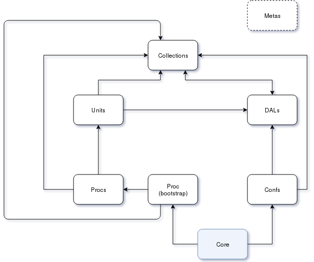

# Nixys Framework Control Tools

## Introduction

Nxs-fw-ctl provides tools to create C programs on Nixys Framework.

General structure of Nixys Framework as follows:



Each block on schema is an isolated (in accordance with arrows) Nixys Framework programming object:

*  **Core**

    This object makes only two things:
    
    *  calls `Confs` to read configurations from command line and file
    *  calls bootstrap process to run applications
    
*  **Confs**

    `Confs` used for processing command line arguments and read configuration files.
    
    Basically Nixys Framework provides two formats for configuration files: ini-like and json. In your application you may use either one of them or both together.

*  **Procs**

    This programming object contains the application logic. It may consist of subprocesses. Each `Process` is either a particular process in OS or a program structural unit.
    Every `Proc` (excluding Bootstrap process) is operated with `Units` and `Collections`.
    
    Bootstrap process makes general for all `Procs` actions, such as program daemonizing, creating program context and manipulating with subprocesses.
    
    Application must consist of one or more `Proc` programming objects.

*  **Units**

    `Units` provide the application structural units logic (e.g. user's context, ...).
    
    Each `Unit` has its own context and basic functions to init and free the context. You may expand `Unit` functionality after creation in accordance with your requirements.

*  **Collections**

    `Collections` is an internal application tool set to make general things, such as strings formatting, calculations and other.
    
    For example, it may be useful to create the wrap to write logs and so on.

*  **DALs**

    `DALs` is a *Data Application Layer* and used for handling data from different sources (databases, filesystem, external Rest API interfaces,  etc).
    
    Each `Dal` has its own context.

*  **Metas**

    `Metas` provides some general data for all applications. Usual `Meta` contains the structures and enums to be used in othes Nixys Framework programming objects.
    
    For example, `Meta` may be useful to transfer large number of elements between the `DAL` and `Unit` contexts.

You may consider the nxs-fw-ctl source core as an example of Nixys Framework application.

### Available nxs-fw-ctl commands

*  View help

    ```
    nxs-fw-ctl -h
    ```

*  View nxs-fw-ctl version

    ```
    nxs-fw-ctl -v
    ```

*  Work with project

    ```
    nxs-fw-ctl -a project new_project_name
    ```
    
    It will create project with name **new_project_name** in the current directory. If you want to create the project in a different directory use '-r' option.
    
    To delete current project (you must be in the project's work directory) use:
    
    ```
    nxs-fw-ctl -d project
    ```

*  Work with 'unit', 'collection', 'meta', 'proc', 'conf' or 'dal'

    ```
    nxs-fw-ctl -a unit new_unit_name
    ```
    
    It will create a new unit with name **new_unit_name** for current project (you must be in project's work directory). Use keywords insteed of 'unit' to create other Nixys Framework programming objects.
    
    To delete Nixys Framework programming objects in the current project use the following command:
    
    ```
    nxs-fw-ctl -d unit new_unit_name
    ```

*  View and change Nixys Framework core modules

    Get the list of modules used in the current project:
   
    ```
    nxs-fw-ctl -i core
    ```
    
    Change modules used in the current project:
    
    ```
    nxs-fw-ctl -u core
    ```

* View and change Nixys Framework Libraries version

    Get the version of Nixys Framework Libraries modules for current project:
   
    ```
    nxs-fw-ctl -i version
    ```
    
    Change the version of Nixys Framework Libraries for current project:
    
    ```
    nxs-fw-ctl -u version
    ```

## Install

1.  Add the Nixys repository key:

    ```
    wget -O - http://packages.nixys.ru/packages.nixys.ru.gpg.key | apt-key add -
    ```

2.  Add the repository. Debian jessie and wheezy are available:

    ```
    echo "deb [arch=amd64] http://packages.nixys.ru/debian/ jessie main" > /etc/apt/sources.list.d/packages.nixys.ru.list
    ```

    ```
    echo "deb [arch=amd64] http://packages.nixys.ru/debian/ wheezy main" > /etc/apt/sources.list.d/packages.nixys.ru.list
    ```

3.  Make an update:

    ```
    apt-get update
    ```

4.  Choose and install needed nxs-fw-libs version. For example:

    ```
    apt-get install nxs-fw-ctl
    ```

5. You also need to install one or more different versions of [Nixys Framework Libraries](https://github.com/nixys/nxs-fw-libs) before creating any project.